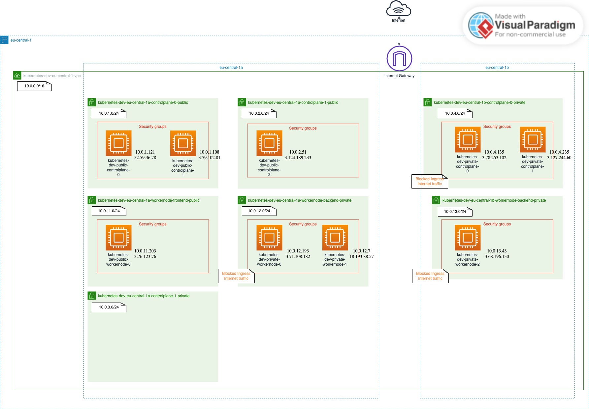

<!-- BEGIN_TF_DOCS -->

# k8s
This module can be used to `configure and provision` the necessary `AWS resources` for a `Kubernetes Cluster`.

The Kuberntes Cluster AWS EC2 instances can be either `public EC2 instances` which are reachable from the internet or `private EC2 instances` which are not. However, private EC2 instances can reach the internet themselves.

The Kubernebtes AWS `EC2 instances` are of two `types`:
<ul>
<li>control plane</li>
<li>worker node</li>
</ul>

The Kubernebtes `EC2 instances are configrued` with the appropriate set of `AWS Security Groups` based on their:
<ul>
<li>Kubernetes instance type (Control plane / Worker node)</li>
<li>Instance scope (public / private)</li>
</ul>

## Requirements

| Name | Version |
|------|---------|
| <a name="requirement_terraform"></a> [terraform](#requirement\_terraform) | >= 1.5.6 |
| <a name="requirement_aws"></a> [aws](#requirement\_aws) | 5.15.0 |
## Providers

| Name | Version |
|------|---------|
| <a name="provider_aws"></a> [aws](#provider\_aws) | 5.15.0 |
## Modules

| Name | Source | Version |
|------|--------|---------|
| <a name="module_k8s_network_vpc"></a> [k8s\_network\_vpc](#module\_k8s\_network\_vpc) | ./network/vpc | n/a |
| <a name="module_k8s_network_subnet"></a> [k8s\_network\_subnet](#module\_k8s\_network\_subnet) | ./network/subnet | n/a |
| <a name="module_k8s_network_elastic_ip"></a> [k8s\_network\_elastic\_ip](#module\_k8s\_network\_elastic\_ip) | ./network/elastic_ip | n/a |
| <a name="module_k8s_network_internet_gateway"></a> [k8s\_network\_internet\_gateway](#module\_k8s\_network\_internet\_gateway) | ./network/internet_gateway | n/a |
| <a name="module_k8s_network_nat_gateway"></a> [k8s\_network\_nat\_gateway](#module\_k8s\_network\_nat\_gateway) | ./network/nat_gateway | n/a |
| <a name="module_k8s_network_route_table"></a> [k8s\_network\_route\_table](#module\_k8s\_network\_route\_table) | ./network/route_table | n/a |
| <a name="module_k8s_network_route_table_association"></a> [k8s\_network\_route\_table\_association](#module\_k8s\_network\_route\_table\_association) | ./network/route_table_association | n/a |
| <a name="module_k8s_network_security_group"></a> [k8s\_network\_security\_group](#module\_k8s\_network\_security\_group) | ./network/security_group | n/a |
| <a name="module_k8s_iam_role"></a> [k8s\_iam\_role](#module\_k8s\_iam\_role) | ./iam/role | n/a |
| <a name="module_k8s_iam_instance_profile"></a> [k8s\_iam\_instance\_profile](#module\_k8s\_iam\_instance\_profile) | ./iam/instance_profile | n/a |
| <a name="module_k8s_ec2_key_pair"></a> [k8s\_ec2\_key\_pair](#module\_k8s\_ec2\_key\_pair) | ./ec2/key_pair | n/a |
| <a name="module_k8s_ec2_instance"></a> [k8s\_ec2\_instance](#module\_k8s\_ec2\_instance) | ./ec2/instance | n/a |
## Resources

| Name | Type |
|------|------|
| [aws_region.current](https://registry.terraform.io/providers/hashicorp/aws/5.15.0/docs/data-sources/region) | data source |
## Inputs

| Name | Description | Type | Default | Required |
|------|-------------|------|---------|:--------:|
| <a name="input_k8s_region"></a> [k8s\_region](#input\_k8s\_region) | The AWS region for provisioning the Kubernetes cluster | `string` | n/a | yes |
| <a name="input_k8s_profile"></a> [k8s\_profile](#input\_k8s\_profile) | The AWS configuration profile | `string` | `"default"` | no |
| <a name="input_k8s_common_tags"></a> [k8s\_common\_tags](#input\_k8s\_common\_tags) | The common AWS Tags to apply on all module's resources | `map(string)` | <pre>{<br>  "owner": "senjoux",<br>  "project": "lab",<br>  "stage": "dev"<br>}</pre> | no |
| <a name="input_k8s_vpc_cidr_block"></a> [k8s\_vpc\_cidr\_block](#input\_k8s\_vpc\_cidr\_block) | The IPv4 CIDR block of the Kubernetes AWS VPC | `string` | n/a | yes |
| <a name="input_k8s_control_plane_subnets"></a> [k8s\_control\_plane\_subnets](#input\_k8s\_control\_plane\_subnets) | The list of Kubernetes control plane AWS subnets objects. Subnets can have either public or private.<br>Public control planes have both Ingress & Egress Internet traffic. Private control planes have only Egress Internet traffic.<br>Private control plane subnets can be:<br>  - (per default) provisioned as public AWS subnets with blocked Ingress internet traffic on EC2 Instance Security Groups level, however Egress Internet access is allowed.<br>  - provisioned as real private AWS subnets (blocked Ingress internet traffic on subnet level). Egress Internet access follows through a NAT Gateway (extra costs apply)<br>See also "k8s\_use\_real\_private\_aws\_subnets" Variable. | <pre>list(object({<br>    cidr_block        = string,<br>    availability_zone = string,<br>    type              = string,<br>    usage_extra       = string,<br>  }))</pre> | n/a | yes |
| <a name="input_k8s_worker_node_subnets"></a> [k8s\_worker\_node\_subnets](#input\_k8s\_worker\_node\_subnets) | The list of Kubernetes worker node AWS subnets objects. Subnets can have either public or private.<br>Public worker nodes have both Ingress & Egress Internet traffic. Private worker nodes have only Egress Internet traffic.<br>Private worker node subnets can be:<br>  - (per default) provisioned as public AWS subnets with blocked Ingress internet traffic on EC2 Instance Security Groups level, however Egress Internet access is allowed.<br>  - provisioned as real private AWS subnets (blocked Ingress internet traffic on subnet level). Egress Internet access follows through a NAT Gateway (extra costs apply)<br>See also "k8s\_use\_real\_private\_aws\_subnets" Variable. | <pre>list(object({<br>    cidr_block        = string,<br>    availability_zone = string,<br>    type              = string,<br>    usage_extra       = string,<br>  }))</pre> | n/a | yes |
| <a name="input_k8s_use_real_private_aws_subnets"></a> [k8s\_use\_real\_private\_aws\_subnets](#input\_k8s\_use\_real\_private\_aws\_subnets) | Control what type of subnets to use for private control planes & private worker nodes subnets."<br>Private subnets can be:<br>  - (per default) provisioned as public AWS subnets with blocked Ingress internet traffic on EC2 Instance Security Groups level, however Egress Internet access is allowed.<br>  - provisioned as real private AWS subnets (blocked Ingress internet traffic on subnet level). Egress Internet access follows through a NAT Gateway (extra costs apply) | `bool` | `false` | no |
| <a name="input_k8s_nat_subnets"></a> [k8s\_nat\_subnets](#input\_k8s\_nat\_subnets) | The list of AWS NAT subnets objects. <br>The NAT Subnets are all public AWS Subnets.<br>The NAT Subnets will be created only if "k8s\_use\_real\_private\_aws\_subnets" is set to "true". | `map(string)` | `{}` | no |
| <a name="input_k8s_key_pair_existant_key_pair_name"></a> [k8s\_key\_pair\_existant\_key\_pair\_name](#input\_k8s\_key\_pair\_existant\_key\_pair\_name) | The existant AWS key pair name. If no existant key pair name if provided, a new AWS key pair will be created. The key pair will be provided to the Kubernetes AWS EC2 instances on provisioing | `string` | `null` | no |
| <a name="input_k8s_key_pair_public_key_file"></a> [k8s\_key\_pair\_public\_key\_file](#input\_k8s\_key\_pair\_public\_key\_file) | The SSH public key file for creating the new AWS key pair. The key will be used for SSH accessing the Kubernetes AWS EC2 instance(s) | `string` | `null` | no |
| <a name="input_k8s_ec2_instance_ami"></a> [k8s\_ec2\_instance\_ami](#input\_k8s\_ec2\_instance\_ami) | The AWS AMI to be used for AWS EC2 instances | `string` | n/a | yes |
| <a name="input_k8s_control_plane_instances"></a> [k8s\_control\_plane\_instances](#input\_k8s\_control\_plane\_instances) | The list of Kubernetes control plane AWS EC2 instance(s) objects | <pre>list(object({<br>    instance_type       = string,<br>    type                = string,<br>    subnet_usage_filter = string,<br>    az_filter           = optional(string, "a"),<br>  }))</pre> | n/a | yes |
| <a name="input_k8s_worker_node_instances"></a> [k8s\_worker\_node\_instances](#input\_k8s\_worker\_node\_instances) | The list of Kubernetes worker node AWS EC2 instance(s) objects | <pre>list(object({<br>    instance_type       = string,<br>    type                = string,<br>    subnet_usage_filter = string,<br>    az_filter           = optional(string, "a"),<br>  }))</pre> | n/a | yes |
## Outputs

| Name | Description |
|------|-------------|
| <a name="output_k8s_vpc_id"></a> [k8s\_vpc\_id](#output\_k8s\_vpc\_id) | The Kubernetes AWS VPC ID |
| <a name="output_k8s_vpc_name"></a> [k8s\_vpc\_name](#output\_k8s\_vpc\_name) | The Kubernetes AWS VPC name |
| <a name="output_k8s_all_kubernetes_subnet_id"></a> [k8s\_all\_kubernetes\_subnet\_id](#output\_k8s\_all\_kubernetes\_subnet\_id) | The IDs of all Kubernetes subnets (excluding the NAT subnets) |
| <a name="output_k8s_all_subnet_id"></a> [k8s\_all\_subnet\_id](#output\_k8s\_all\_subnet\_id) | The IDs of all subnets (including the NAT subnets) |
| <a name="output_k8s_nat_subnet_id_az"></a> [k8s\_nat\_subnet\_id\_az](#output\_k8s\_nat\_subnet\_id\_az) | The IDs of all NAT subnets mapped to their availability zone |
| <a name="output_k8s_all_kubernetes_private_subnet_id_az"></a> [k8s\_all\_kubernetes\_private\_subnet\_id\_az](#output\_k8s\_all\_kubernetes\_private\_subnet\_id\_az) | The IDs of all private Kubernetes subnets mapped to their availability zones |
| <a name="output_k8s_nat_eip_az"></a> [k8s\_nat\_eip\_az](#output\_k8s\_nat\_eip\_az) | The IDs of all Elastic IP addresses to be used for creating the NATs |
| <a name="output_k8s_internet_gateway_id"></a> [k8s\_internet\_gateway\_id](#output\_k8s\_internet\_gateway\_id) | The Kuberntes VPC's Internet Gateway ID |
| <a name="output_k8s_nat_az"></a> [k8s\_nat\_az](#output\_k8s\_nat\_az) | The IDs of all NAT mapped to their NAT availability zone |
| <a name="output_k8s_internet_gateway_access_route_table_id"></a> [k8s\_internet\_gateway\_access\_route\_table\_id](#output\_k8s\_internet\_gateway\_access\_route\_table\_id) | The ID of AWS Route Table used for accessing the internet from the Kubernetes AWS Subnets |
| <a name="output_k8s_nat_gateway_access_route_table_id"></a> [k8s\_nat\_gateway\_access\_route\_table\_id](#output\_k8s\_nat\_gateway\_access\_route\_table\_id) | The ID of AWS Route Table used for accessing NAT Gateway from the Kubernetes AWS Subnets |
| <a name="output_k8s_public_control_plane_security_group_ids"></a> [k8s\_public\_control\_plane\_security\_group\_ids](#output\_k8s\_public\_control\_plane\_security\_group\_ids) | The IDs of all AWS security groups to be used by public Kubernetes control planes |
| <a name="output_k8s_private_control_plane_security_group_ids"></a> [k8s\_private\_control\_plane\_security\_group\_ids](#output\_k8s\_private\_control\_plane\_security\_group\_ids) | The IDs of all AWS security groups to be used by private Kubernetes control planes |
| <a name="output_k8s_public_worker_node_security_group_ids"></a> [k8s\_public\_worker\_node\_security\_group\_ids](#output\_k8s\_public\_worker\_node\_security\_group\_ids) | The IDs of all AWS security groups to be used by public Kubernetes worker nodes |
| <a name="output_k8s_private_worker_node_security_group_ids"></a> [k8s\_private\_worker\_node\_security\_group\_ids](#output\_k8s\_private\_worker\_node\_security\_group\_ids) | The IDs of all AWS security groups to be used by private Kubernetes worker nodes |
| <a name="output_k8s_key_pair_key_name"></a> [k8s\_key\_pair\_key\_name](#output\_k8s\_key\_pair\_key\_name) | The AWS key pair which will be provided to the Kubernetes AWS EC2 instance(s) on provisioing |
| <a name="output_k8s_public_control_planes"></a> [k8s\_public\_control\_planes](#output\_k8s\_public\_control\_planes) | The list of created public Kubernetes control plane AWS EC2 instance(s). The details cover the ID, public\_ip, Name tag, usage tag and usage extra tag of the EC2 instance |
| <a name="output_k8s_private_control_planes"></a> [k8s\_private\_control\_planes](#output\_k8s\_private\_control\_planes) | The list of created private Kubernetes control plane AWS EC2 instance(s). The details cover the ID, public\_ip, Name tag, usage tag and usage extra tag of the EC2 instance |
| <a name="output_k8s_public_worker_nodes"></a> [k8s\_public\_worker\_nodes](#output\_k8s\_public\_worker\_nodes) | The list of created public Kubernetes worker node AWS EC2 instance(s). The details cover the ID, public\_ip, Name tag, usage tag and usage extra tag of the EC2 instance |
| <a name="output_k8s_private_worker_nodes"></a> [k8s\_private\_worker\_nodes](#output\_k8s\_private\_worker\_nodes) | The list of created private Kubernetes worker node AWS EC2 instance(s). The details cover the ID, public\_ip, Name tag, usage tag and usage extra tag of the EC2 instance |

# Examples
## Kubernetes Cluster: Simple
In this example `private control-plane and worker-node subnets` are provisioned as `public AWS subnets` with `blocked Ingress internet traffic` on `EC2 Instance Security Groups` level, however `Egress Internet access` is `allowed`.

 |

```hcl
### Simple Kubernetes Cluster AWS-Infrastructure
# k8s/examples/main.tf

locals {
  # ------------------ Common ------------------
  k8s_region = "eu-central-1"
  # k8s_profile = "default"

  k8s_common_tags = {
    project = "k8s_lab"
    owner   = "hamza"
    stage   = "dev"
  }

  # ------------------ VPC ------------------
  k8s_vpc_cidr_block = "10.0.0.0/16"

  # ------------------ Subnets ------------------
  k8s_control_plane_subnets = [
    {
      cidr_block        = "10.0.1.0/24",
      availability_zone = "a",
      type              = "public",
      usage_extra       = "0", # can use "0", "foo", "bar" .. or whatever plain string
    },
    {
      cidr_block        = "10.0.2.0/24",
      availability_zone = "a",
      type              = "public",
      usage_extra       = "1", # can use "0", "foo", "bar" .. or whatever plain string
    },
    {
      cidr_block        = "10.0.3.0/24",
      availability_zone = "a",
      type              = "private",
      usage_extra       = "1", # can use "0", "foo", "bar" .. or whatever plain string
    },
    {
      cidr_block        = "10.0.4.0/24",
      availability_zone = "b",
      type              = "private",
      usage_extra       = "0",
    },
  ]

  k8s_worker_node_subnets = [
    {
      cidr_block        = "10.0.11.0/24",
      availability_zone = "a",
      type              = "public",
      usage_extra       = "frontend",
    },
    {
      cidr_block        = "10.0.12.0/24",
      availability_zone = "a",
      type              = "private"
      usage_extra       = "backend",
    },
    {
      cidr_block        = "10.0.13.0/24",
      availability_zone = "b",
      type              = "private",
      usage_extra       = "backend",
    },
  ]

  # ------------------ EC2 Instance ------------------
  k8s_key_pair_existant_key_pair_name = "k8s"   # use an existant AWS key pair
  # k8s_key_pair_public_key_file = "/path/to/mykey.pub" # create a new AWS key pair

  # ------------------ EC2 Instance ------------------

  k8s_ec2_instance_ami = "ami-084872984773e3cde" # Ubuntu Kinetic Kudu in eu-central-1

  k8s_control_plane_instances = [
    # 2 public control planes within the public subnet of usage "0" in the eu-central-1a availability zone
    {
      instance_type       = "t2.micro",
      type                = "public",
      subnet_usage_filter = "0",
      # az_filter           = "a" # default to "a"
    },
      {
      instance_type       = "t2.micro",
      type                = "public",
      subnet_usage_filter = "0",
      # az_filter           = "a" # default to "a"
    },
    # 1 private control plane within the private subnet of usage "0" in the eu-central-1a availability zone
    {
      instance_type       = "t2.micro",
      type                = "public",
      subnet_usage_filter = "1",
      # az_filter           = "a" # default to "a"
    },
    # 2 private control planes within the private subnet of usage "0" in the eu-central-1b availability zone
    {
      instance_type       = "t2.micro",
      type                = "private",
      subnet_usage_filter = "0",
      az_filter           = "b"
    },
    {
      instance_type       = "t2.micro",
      type                = "private",
      subnet_usage_filter = "0",
      az_filter           = "b"
    },
  ]

  k8s_worker_node_instances = [
    # 1 public worker node (could be used for frondend Pods) within the public subnet of usage "frontend" in the eu-central-1a availability zone
    {
      instance_type       = "t2.micro",
      type                = "public",
      subnet_usage_filter = "frontend",
      # az_filter           = "a" # default to "a"
    },
    # 2 private worker nodes (could be used for backend Pods) within the private subnet of usage "backend" in the eu-central-1a availability zone
    {
      instance_type       = "t2.micro",
      type                = "private",
      subnet_usage_filter = "backend",
      # az_filter           = "a" # default to "a"
    },
    {
      instance_type       = "t2.micro",
      type                = "private",
      subnet_usage_filter = "backend",
      # az_filter           = "a" # default to "a"
    },
    # 1 private worker nodes (could be used for backend Pods) within the private subnet of usage "backend" in the eu-central-1b availability zone
    {
      instance_type       = "t2.micro",
      type                = "private",
      subnet_usage_filter = "backend",
      az_filter           = "b"
    },
  ]

}

# ------------------ k8s module ------------------
module "k8s" {
  source = "../"

  k8s_region  = local.k8s_region
  #k8s_profile = local.k8s_profile

  k8s_common_tags = local.k8s_common_tags

  k8s_vpc_cidr_block = local.k8s_vpc_cidr_block

  k8s_control_plane_subnets = local.k8s_control_plane_subnets
  k8s_worker_node_subnets   = local.k8s_worker_node_subnets

  k8s_ec2_instance_ami = local.k8s_ec2_instance_ami
  k8s_key_pair_existant_key_pair_name = local.k8s_key_pair_existant_key_pair_name # use an existant AWS key pair
  # k8s_key_pair_public_key_file = local.k8s_key_pair_public_key_file # create a new AWS key pair

  k8s_control_plane_instances = local.k8s_control_plane_instances
  k8s_worker_node_instances   = local.k8s_worker_node_instances

}
```

<!-- END_TF_DOCS -->

## Kubernetes Cluster: Advanced
In this example `private control-plane and worker-node subnets` are provisioned as `real private AWS subnets` (blocked Ingress internet traffic on subnet level). `Egress Internet access` follows `through a NAT Gateway` (extra costs apply).

 |

```hcl
# k8s/examples/main.tf

locals {
  # ------------------ Common ------------------
  k8s_region = "eu-central-1"
  # k8s_profile = "default"

  k8s_common_tags = {
    project = "k8s_lab"
    owner   = "hamza"
    stage   = "dev"
  }

  # ------------------ VPC ------------------
  k8s_vpc_cidr_block = "10.0.0.0/16"

  # ------------------ Subnets ------------------
  k8s_use_real_private_aws_subnets = true

  k8s_nat_subnets = { "a" = "10.0.10.0/24", "b" = "10.0.20.0/24" }

  k8s_control_plane_subnets = [
    {
      cidr_block        = "10.0.1.0/24",
      availability_zone = "a",
      type              = "public",
      usage_extra       = "0", # can use "0", "foo", "bar" .. or whatever plain string
    },
    {
      cidr_block        = "10.0.2.0/24",
      availability_zone = "a",
      type              = "public",
      usage_extra       = "1", # can use "0", "foo", "bar" .. or whatever plain string
    },
    {
      cidr_block        = "10.0.3.0/24",
      availability_zone = "a",
      type              = "private",
      usage_extra       = "1", # can use "0", "foo", "bar" .. or whatever plain string
    },
    {
      cidr_block        = "10.0.4.0/24",
      availability_zone = "b",
      type              = "private",
      usage_extra       = "0",
    },
  ]

  k8s_worker_node_subnets = [
    {
      cidr_block        = "10.0.11.0/24",
      availability_zone = "a",
      type              = "public",
      usage_extra       = "frontend",
    },
    {
      cidr_block        = "10.0.12.0/24",
      availability_zone = "a",
      type              = "private"
      usage_extra       = "backend",
    },
    {
      cidr_block        = "10.0.13.0/24",
      availability_zone = "b",
      type              = "private",
      usage_extra       = "backend",
    },
  ]

  # ------------------ EC2 Instance ------------------
  k8s_key_pair_existant_key_pair_name = "k8s"   # to use an existant AWS key pair
  # k8s_key_pair_public_key_file = "/path/to/mykey.pub" # to create a new AWS key pair

  # ------------------ EC2 Instance ------------------

  k8s_ec2_instance_ami = "ami-084872984773e3cde" # Ubuntu Kinetic Kudu in eu-central-1

  k8s_control_plane_instances = [
    {
      instance_type       = "t2.micro",
      type                = "public",
      subnet_usage_filter = "0"
    },
    {
      instance_type       = "t2.micro",
      type                = "public",
      subnet_usage_filter = "0"
    },
    {
      instance_type       = "t2.micro",
      type                = "public",
      subnet_usage_filter = "1"
    },
    {
      instance_type       = "t2.micro",
      type                = "private",
      subnet_usage_filter = "0"
    },
  ]

  k8s_worker_node_instances = [
    {
      instance_type       = "t2.micro",
      type                = "public",
      subnet_usage_filter = "frontend",
      # az_filter           = "b" # default to "a"
    },
    {
      instance_type       = "t2.micro",
      type                = "private",
      subnet_usage_filter = "backend",
      # az_filter           = "b" # default to "a"
    },
    {
      instance_type       = "t2.micro",
      type                = "private",
      subnet_usage_filter = "backend",
      az_filter           = "b"
    },
  ]

}

# ------------------ k8s module ------------------
module "k8s" {
  source = "../../"

  k8s_region  = local.k8s_region
  #k8s_profile = local.k8s_profile

  k8s_common_tags = local.k8s_common_tags

  k8s_vpc_cidr_block = local.k8s_vpc_cidr_block

  k8s_control_plane_subnets = local.k8s_control_plane_subnets
  k8s_worker_node_subnets   = local.k8s_worker_node_subnets

  k8s_use_real_private_aws_subnets = local.k8s_use_real_private_aws_subnets
  k8s_nat_subnets = local.k8s_nat_subnets

  k8s_ec2_instance_ami = local.k8s_ec2_instance_ami
  k8s_key_pair_existant_key_pair_name = local.k8s_key_pair_existant_key_pair_name # to use an existant AWS key pair
  # k8s_key_pair_public_key_file = local.k8s_key_pair_public_key_file # to create a new AWS key pair

  k8s_control_plane_instances = local.k8s_control_plane_instances
  k8s_worker_node_instances   = local.k8s_worker_node_instances

}
```

<!-- END_TF_DOCS -->